# 📅 Day 1: Backend Fundamentals & MERN Stack Introduction

<div align="center">

```
🎯 DAY 1 LEARNING OBJECTIVES 🎯

Frontend ↔️ Backend Communication
APIs & Runtime Environment
MERN Stack Architecture
Backend Core Responsibilities
```

</div>

---

## 🌐 Frontend vs Backend: How They Work Together

### 🎨 **Frontend (Client-Side)**
- **What users see and interact with**
- **Technologies**: HTML, CSS, JavaScript, React
- **Responsibilities**: UI/UX, user interactions, data presentation

### ⚙️ **Backend (Server-Side)**
- **What users don't see but powers everything**
- **Technologies**: Node.js, Express, databases
- **Responsibilities**: Business logic, data processing, security

### 🔄 **How They Communicate**

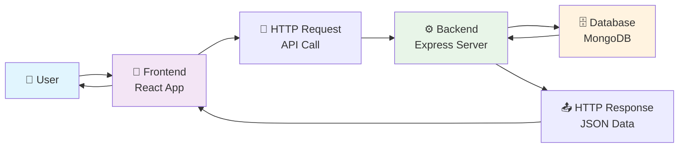

---

## 🔗 What Are APIs?

### 📋 **API Definition**
**API (Application Programming Interface)** = A set of rules and protocols that allow different software applications to communicate with each other.

### 🌟 **Real-World API Examples**

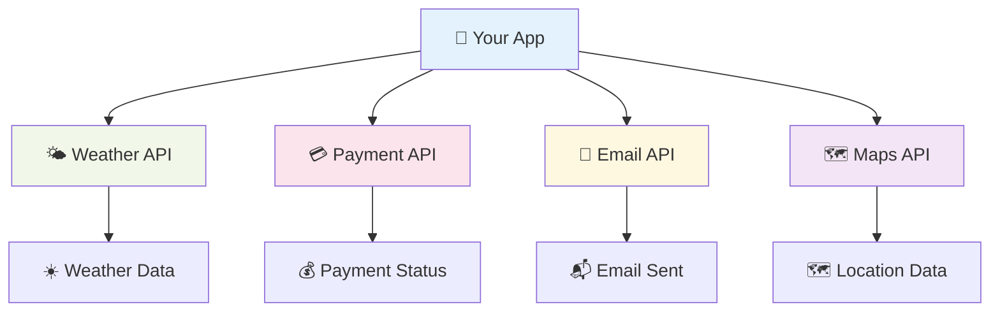

### 🛠️ **API Types We'll Work With**

| API Type | Purpose | Example |
|----------|---------|---------|
| **REST API** | Standard web APIs | `GET /api/users` |
| **GraphQL** | Flexible data queries | Single endpoint, custom queries |
| **Third-party APIs** | External services | Google Maps, Stripe Payment |
| **Internal APIs** | Your own services | User management, file upload |

### 📊 **HTTP Status Codes - The Language of APIs**

Status codes tell us what happened with our API request. Think of them as the API's way of saying "success!", "you made a mistake", or "something went wrong on my end".

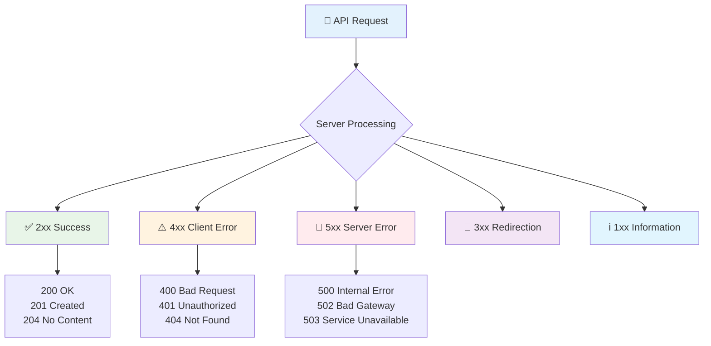

### 🎯 **Most Common Status Codes**

| Code | Name | Meaning | When to Use |
|------|------|---------|-------------|
| **200** | OK | ✅ Success | Data retrieved successfully |
| **201** | Created | ✅ Resource created | User registered, post created |
| **400** | Bad Request | ⚠️ Invalid input | Missing fields, wrong format |
| **401** | Unauthorized | 🔐 Authentication failed | Invalid login credentials |
| **403** | Forbidden | 🚫 Access denied | User lacks permission |
| **404** | Not Found | 🔍 Resource missing | User/post doesn't exist |
| **409** | Conflict | ⚡ Resource exists | Email already registered |
| **422** | Validation Error | ❌ Data invalid | Form validation failed |
| **500** | Internal Server Error | 🚨 Server problem | Database connection failed |

### 💡 **Status Code Examples in Practice**

```javascript
// ✅ SUCCESS RESPONSES
app.get('/api/users', (req, res) => {
  const users = [{ id: 1, name: 'John' }];
  res.status(200).json({ success: true, data: users });
});

app.post('/api/users', (req, res) => {
  const newUser = { id: 2, name: req.body.name };
  res.status(201).json({ success: true, data: newUser });
});

// ⚠️ CLIENT ERROR RESPONSES
app.post('/api/login', (req, res) => {
  const { email, password } = req.body;
  
  if (!email || !password) {
    return res.status(400).json({
      error: 'Email and password are required'
    });
  }
  
  if (!isValidCredentials(email, password)) {
    return res.status(401).json({
      error: 'Invalid credentials'
    });
  }
});

app.get('/api/users/:id', (req, res) => {
  const user = findUser(req.params.id);
  
  if (!user) {
    return res.status(404).json({
      error: 'User not found'
    });
  }
  
  res.status(200).json({ success: true, data: user });
});

// 🚨 SERVER ERROR RESPONSES
app.get('/api/data', (req, res) => {
  try {
    const data = getDataFromDatabase();
    res.status(200).json({ success: true, data });
  } catch (error) {
    console.error(error);
    res.status(500).json({
      error: 'Internal server error'
    });
  }
});
```

### 🎨 **Frontend Handling of Status Codes**

```javascript
// How frontend handles different status codes
async function loginUser(email, password) {
  try {
    const response = await fetch('/api/login', {
      method: 'POST',
      headers: { 'Content-Type': 'application/json' },
      body: JSON.stringify({ email, password })
    });
    
    if (response.status === 200) {
      const data = await response.json();
      showSuccess('Login successful!');
      redirectToDashboard();
    } else if (response.status === 401) {
      showError('Invalid email or password');
    } else if (response.status === 400) {
      showError('Please fill in all fields');
    } else if (response.status === 500) {
      showError('Server error. Please try again later.');
    }
  } catch (error) {
    showError('Network error. Check your connection.');
  }
}
```

---

## 🏃‍♂️ Runtime Environment: Node.js

### 🤔 **What is a Runtime Environment?**

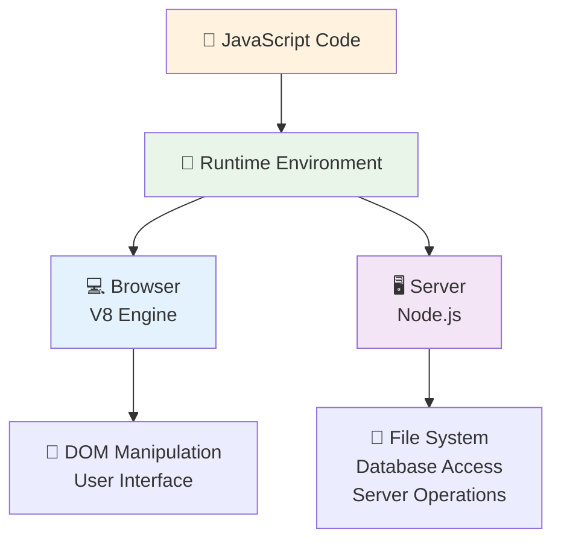

### 🌟 **Why Node.js for Backend?**

- ✅ **Same Language**: JavaScript everywhere (frontend + backend)
- ⚡ **Fast**: Non-blocking, event-driven architecture
- 📦 **Rich Ecosystem**: NPM with millions of packages
- 🔄 **Async by Nature**: Perfect for I/O operations
- 👥 **Large Community**: Extensive support and resources

---

## 🏗️ MERN Stack Architecture

### 🎯 **What is MERN?**

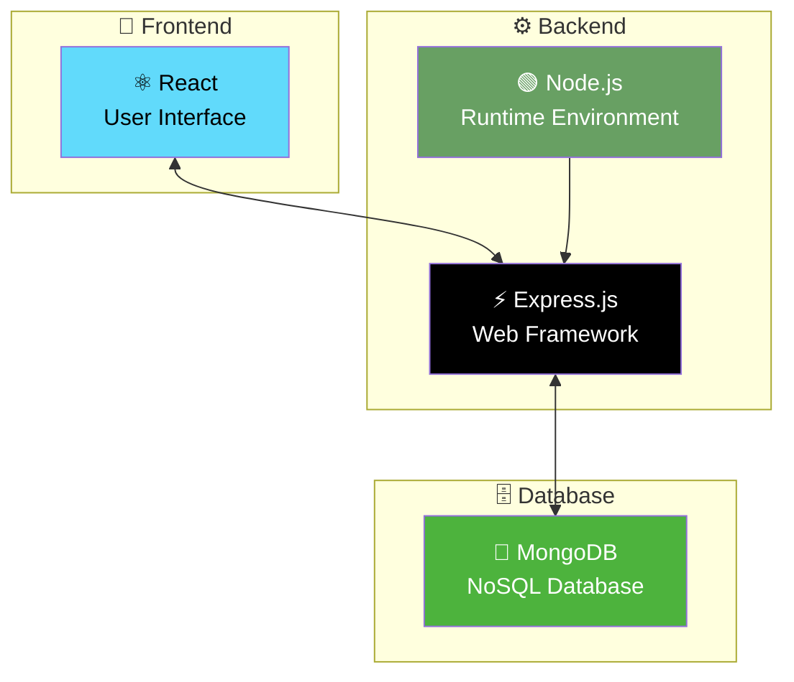

### 📊 **MERN Stack Components**

| Component | Purpose | Key Features |
|-----------|---------|--------------|
| **🍃 MongoDB** | Database | NoSQL, Document-based, Flexible schema |
| **⚡ Express.js** | Web Framework | Minimal, Fast, Middleware support |
| **⚛️ React** | Frontend Library | Component-based, Virtual DOM, State management |
| **🟢 Node.js** | Runtime | JavaScript on server, Event-driven, NPM ecosystem |

---

## 🎯 Three Core Backend Responsibilities

### 1️⃣ **Data Management** 🗄️

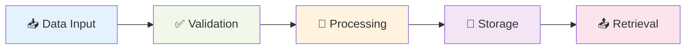

**Examples:**
- 👤 User registration and authentication
- 📝 CRUD operations (Create, Read, Update, Delete)
- 🔍 Data validation and sanitization
- 📊 Data aggregation and reporting

### 2️⃣ **File Management** 📁

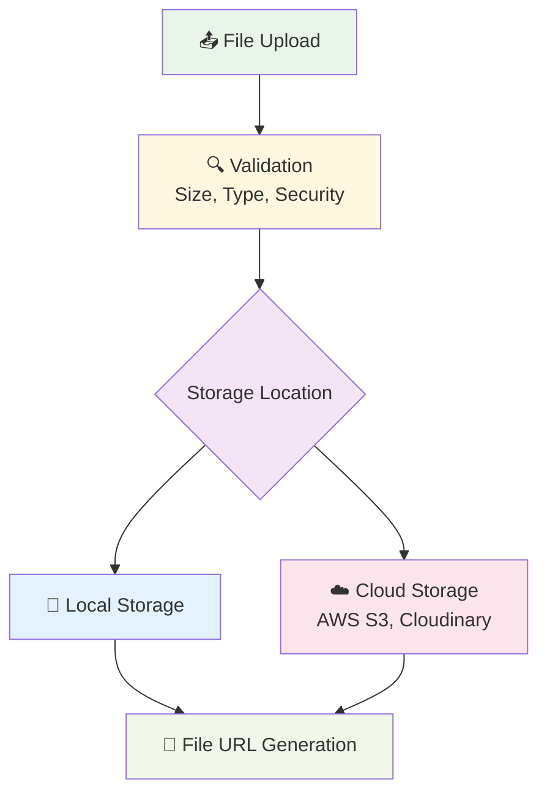

**Examples:**
- 🖼️ Image and video uploads
- 📄 Document management
- 📊 CSV/Excel file processing
- 🎵 Media file handling

### 3️⃣ **External API Communication** 🌐

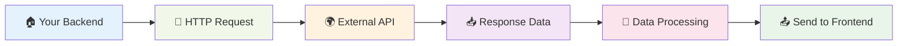

**Examples:**
- 💳 Payment processing (Stripe, PayPal)
- 📧 Email services (SendGrid, Mailgun)
- 🌤️ Weather data (OpenWeatherMap)
- 🗺️ Location services (Google Maps)
- 📱 SMS notifications (Twilio)

---

## 🔄 Complete Request-Response Flow

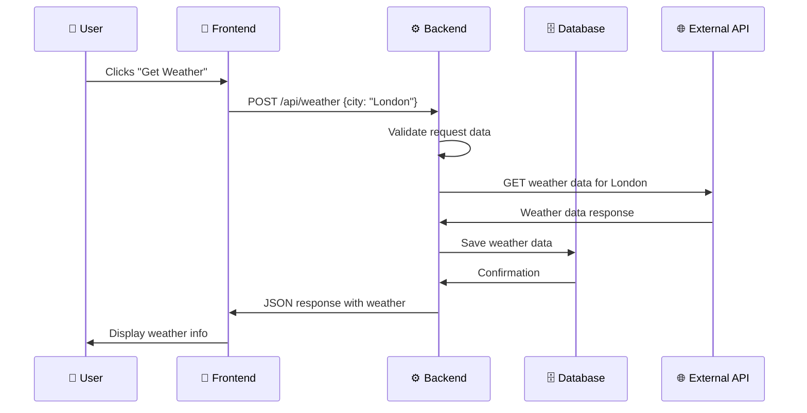

---

## 🎯 Day 1 Key Takeaways

### ✅ **What You Learned Today**

1. **🔄 Frontend-Backend Relationship**: How they communicate through APIs
2. **🔗 APIs Fundamentals**: What they are and why they're essential
3. **🏃‍♂️ Node.js Runtime**: JavaScript on the server-side
4. **🏗️ MERN Stack Architecture**: How all components work together
5. **🎯 Backend Core Responsibilities**: Data, Files, and External APIs

### 🚀 **Next Steps**

- **Day 2**: Setting up Node.js development environment
- **Day 3**: Creating your first Express.js server
- **Day 4**: Understanding middleware and routing
- **Day 5**: Connecting to MongoDB database

---

## 📚 Additional Resources

### 🎥 **Recommended Videos**
- [What is an API?](https://www.youtube.com/watch?v=s7wmiS2mSXY)
- [Node.js Explained](https://www.youtube.com/watch?v=uVwtVBpw7RQ)
- [MERN Stack Overview](https://www.youtube.com/watch?v=7CqJlxBYj-M)

### 📖 **Reading Materials**
- [REST API Best Practices](https://restfulapi.net/)
- [Node.js Official Documentation](https://nodejs.org/en/docs/)
- [Express.js Guide](https://expressjs.com/en/starter/installing.html)

### 🛠️ **Tools to Install**
- [Node.js](https://nodejs.org/) - JavaScript runtime
- [Postman](https://www.postman.com/) - API testing
- [MongoDB Compass](https://www.mongodb.com/products/compass) - Database GUI
- [VS Code](https://code.visualstudio.com/) - Code editor

---

## 🚀 Node.js Installation & Setup

### 📥 **Step 1: Download & Install Node.js**

1. **Visit**: [https://nodejs.org/](https://nodejs.org/)
2. **Download**: LTS (Long Term Support) version
3. **Install**: Follow the installer instructions
4. **Verify Installation**:

```bash
# Check Node.js version
node --version
# Should show: v18.x.x or higher

# Check NPM version
npm --version
# Should show: 9.x.x or higher
```

### 🎯 **Step 2: Create Your First Node.js Project**

```bash
# Create project directory
mkdir my-backend-project
cd my-backend-project

# Initialize npm project
npm init -y

# Install Express.js
npm install express

# Create main server file
touch server.js
```

### 📝 **Step 3: Basic Server Setup**

```javascript
// server.js
const express = require('express');
const app = express();
const PORT = 3000;

// Basic route
app.get('/', (req, res) => {
  res.json({ message: 'Hello from Backend!' });
});

// Start server
app.listen(PORT, () => {
  console.log(`Server running on http://localhost:${PORT}`);
});
```

### ▶️ **Step 4: Run Your Server**

```bash
# Start the server
node server.js

# Visit: http://localhost:3000
# You should see: {"message": "Hello from Backend!"}
```

---

## 📡 Request & Response Deep Dive

### 🔍 **What is a Request (req)?**

The **request object** contains all information about the HTTP request sent from the client (frontend) to the server (backend).

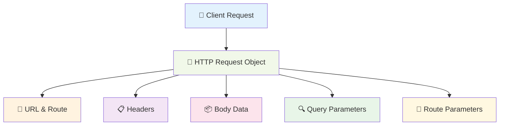

### 📋 **Request Object Properties**

```javascript
app.get('/users/:id', (req, res) => {
  console.log('=== REQUEST OBJECT BREAKDOWN ===');
  
  // 1. Route Parameters
  console.log('Route Params:', req.params);
  // Example: { id: "123" } from /users/123
  
  // 2. Query Parameters
  console.log('Query Params:', req.query);
  // Example: { name: "john", age: "25" } from /users/123?name=john&age=25
  
  // 3. Request Headers
  console.log('Headers:', req.headers);
  // Example: { "content-type": "application/json", "authorization": "Bearer token" }
  
  // 4. Request Body (for POST/PUT requests)
  console.log('Body:', req.body);
  // Example: { "name": "John", "email": "john@email.com" }
  
  // 5. HTTP Method
  console.log('Method:', req.method);
  // Example: "GET", "POST", "PUT", "DELETE"
  
  // 6. Full URL
  console.log('URL:', req.url);
  // Example: "/users/123?name=john&age=25"
  
  // 7. Base URL
  console.log('Base URL:', req.baseUrl);
  // Example: "/api/v1"
});
```

### 📤 **What is a Response (res)?**

The **response object** is used to send data back from the server to the client.

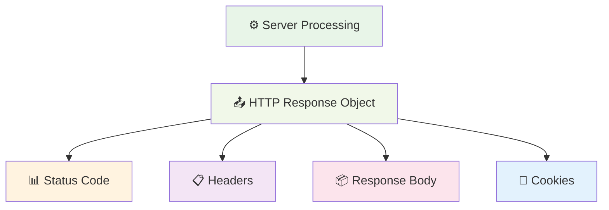

### 📋 **Response Object Methods**

```javascript
app.get('/api/examples', (req, res) => {
  // 1. Send JSON Response
  res.json({ 
    message: 'Success', 
    data: { id: 1, name: 'John' } 
  });
  
  // 2. Set Status Code
  res.status(201).json({ message: 'Created successfully' });
  
  // 3. Send Plain Text
  res.send('Hello World');
  
  // 4. Send HTML
  res.send('<h1>Welcome to Backend</h1>');
  
  // 5. Set Headers
  res.set('Content-Type', 'application/json');
  res.set('X-Custom-Header', 'MyValue');
  
  // 6. Set Cookies
  res.cookie('sessionId', 'abc123', { 
    maxAge: 900000, 
    httpOnly: true 
  });
  
  // 7. Redirect
  res.redirect('/login');
  
  // 8. Send File
  res.sendFile('/path/to/file.pdf');
});
```

### 🔄 **Complete Request-Response Example**

```javascript
// Example: User Registration API
app.post('/api/register', (req, res) => {
  try {
    // 📥 Extract data from request
    const { name, email, password } = req.body;
    const userAgent = req.headers['user-agent'];
    const clientIP = req.ip;
    
    // ✅ Validate request data
    if (!name || !email || !password) {
      return res.status(400).json({
        success: false,
        error: 'Missing required fields',
        required: ['name', 'email', 'password']
      });
    }
    
    // 💾 Process data (save to database)
    const newUser = {
      id: Date.now(),
      name,
      email,
      createdAt: new Date(),
      lastLogin: null
    };
    
    // 📤 Send success response
    res.status(201).json({
      success: true,
      message: 'User registered successfully',
      data: {
        user: newUser,
        token: 'jwt-token-here'
      },
      metadata: {
        requestId: req.headers['x-request-id'],
        timestamp: new Date().toISOString()
      }
    });
    
  } catch (error) {
    // 🚨 Handle errors
    res.status(500).json({
      success: false,
      error: 'Internal server error',
      message: 'Something went wrong'
    });
  }
});
```

---

## 📁 General Backend Project Folder Structure

### 🏗️ **Standard MERN Backend Structure**

```
my-backend-project/
├── 📁 config/                 # Configuration files
│   ├── 🗄️ database.js         # Database connection
│   ├── 🔧 config.js           # App configuration
│   └── 🌍 environment.js      # Environment variables
│
├── 📁 controllers/            # Business logic
│   ├── 👤 authController.js   # Authentication logic
│   ├── 👥 userController.js   # User operations
│   ├── 📝 postController.js   # Post operations
│   └── 📧 emailController.js  # Email operations
│
├── 📁 middleware/             # Custom middleware
│   ├── 🔐 auth.js            # Authentication middleware
│   ├── ❌ errorHandler.js     # Error handling
│   ├── ✅ validation.js       # Input validation
│   └── 📝 logger.js          # Request logging
│
├── 📁 models/                 # Database models
│   ├── 👤 User.js            # User schema
│   ├── 📝 Post.js            # Post schema
│   ├── 💬 Comment.js         # Comment schema
│   └── 📂 Category.js        # Category schema
│
├── 📁 routes/                 # API routes
│   ├── 🔐 auth.js            # Authentication routes
│   ├── 👥 users.js           # User routes
│   ├── 📝 posts.js           # Post routes
│   └── 📧 email.js           # Email routes
│
├── 📁 utils/                  # Utility functions
│   ├── 📧 sendEmail.js       # Email utilities
│   ├── 🔐 generateToken.js   # JWT utilities
│   ├── 📁 fileUpload.js      # File handling
│   └── 🔧 helpers.js         # General helpers
│
├── 📁 uploads/                # File uploads
│   ├── 🖼️ images/            # Image files
│   ├── 📄 documents/         # Document files
│   └── 🎵 media/             # Media files
│
├── 📁 tests/                  # Test files
│   ├── 🧪 unit/              # Unit tests
│   ├── 🔗 integration/       # Integration tests
│   └── 🎯 e2e/               # End-to-end tests
│
├── 📄 server.js               # Main server file
├── 📋 package.json            # Dependencies
├── 🔒 .env                    # Environment variables
├── 🚫 .gitignore             # Git ignore rules
└── 📖 README.md              # Project documentation
```

### 🎯 **Folder Purpose Breakdown**

| Folder | Purpose | Example Files |
|--------|---------|---------------|
| **📁 config/** | App configuration and setup | database.js, config.js |
| **📁 controllers/** | Business logic and operations | userController.js, authController.js |
| **📁 middleware/** | Request processing functions | auth.js, validation.js |
| **📁 models/** | Database schemas and models | User.js, Post.js |
| **📁 routes/** | API endpoint definitions | users.js, auth.js |
| **📁 utils/** | Helper functions and utilities | sendEmail.js, helpers.js |
| **📁 uploads/** | File storage directory | images/, documents/ |
| **📁 tests/** | Test files and test data | unit/, integration/ |

### 📝 **Example File Contents**

#### 🔧 **config/database.js**
```javascript
const mongoose = require('mongoose');

const connectDB = async () => {
  try {
    const conn = await mongoose.connect(process.env.MONGODB_URI);
    console.log(`MongoDB Connected: ${conn.connection.host}`);
  } catch (error) {
    console.error(error);
    process.exit(1);
  }
};

module.exports = connectDB;
```

#### 🛣️ **routes/users.js**
```javascript
const express = require('express');
const router = express.Router();
const userController = require('../controllers/userController');
const auth = require('../middleware/auth');

// GET /api/users
router.get('/', auth, userController.getAllUsers);

// POST /api/users
router.post('/', userController.createUser);

// GET /api/users/:id
router.get('/:id', auth, userController.getUserById);

module.exports = router;
```

#### 👥 **controllers/userController.js**
```javascript
const User = require('../models/User');

exports.getAllUsers = async (req, res) => {
  try {
    const users = await User.find().select('-password');
    res.json({ success: true, data: users });
  } catch (error) {
    res.status(500).json({ success: false, error: error.message });
  }
};

exports.createUser = async (req, res) => {
  try {
    const user = new User(req.body);
    await user.save();
    res.status(201).json({ success: true, data: user });
  } catch (error) {
    res.status(400).json({ success: false, error: error.message });
  }
};
```

---

<div align="center">

**🎉 Congratulations on completing Day 1! 🎉**

*You now understand the fundamentals of backend development and how MERN stack components work together.*

**Ready for Day 2? Let's set up your development environment! 🚀**

</div>
