# 📅 Day 3: CORS & Secure Backend Configuration

<div align="center">

```
🎯 DAY 3 LEARNING OBJECTIVES 🎯

Secure CORS Configuration
Environment Management
Backend Security Best Practices
Frontend-Backend Integration
```

</div>

---

# 🚀 Backend Connection Setup

A secure Express.js backend with React frontend, focusing on proper CORS configuration and environment management for backend connection setup.

## 🗂️ Project Structure

```mermaid
graph TD
    A[📁 day_003] --> B[⚙️ Backend]
    A --> C[🎨 Frontend]
    
    B --> D[📄 .env]
    B --> E[📄 server.js]
    B --> F[📦 package.json]
    
    C --> G[📁 src/]
    C --> H[📄 index.html]
    C --> I[⚙️ vite.config.js]
    C --> J[📦 package.json]
    
    style A fill:#e3f2fd,stroke:#1976d2
    style B fill:#e8f5e9,stroke:#2e7d32
    style C fill:#fff3e0,stroke:#ef6c00
```



### 📁 Directory Breakdown

| Path | Description | Key Files |
|------|-------------|-----------|
| **`/backend`** | Express.js server | `server.js`, `.env` |
| **`/frontend`** | React application | `src/`, `vite.config.js` |

## ✨ Key Features

### ⚙️ **Backend**
- **Express.js** web server with RESTful API
- **Secure CORS** configuration with dynamic origin whitelisting
- **Environment-based** configuration using `dotenv`
- **Development** hot-reload with `nodemon`
- **Production-ready** error handling
- **Connection Management** for future database integration

### 🎨 **Frontend**
- **React 19** with Vite for fast development
- **Modern ES modules** for clean code
- **ESLint** and Prettier for code quality
- **Axios** for HTTP requests with interceptors
- **Vite Proxy** for seamless API integration

## 🛠️ Prerequisites

- Node.js (v16+ recommended)
- npm (v8+)
- Modern web browser (Chrome, Firefox, Edge)
- Code editor (VS Code recommended)

## 🚀 Getting Started

### ⚙️ **Backend Setup**

```bash
# 1. Navigate to backend
cd backend

# 2. Install dependencies
npm install

# 3. Configure environment
cp .env.sample .env
# Edit .env with your configuration

# 4. Start development server
npm run dev
# Server running on http://localhost:3000
```

### 🎨 **Frontend Setup**

```bash
# 1. Navigate to frontend
cd frontend

# 2. Install dependencies
npm install

# 3. Start development server
npm run dev
# App running on http://localhost:5173
```

### 🌐 **Development Workflow**

```mermaid
sequenceDiagram
    participant D as 🖥️  Developer
    participant F as 🎨  Frontend (Port 5173)
    participant B as ⚙️  Backend (Port 3000)
    
    D->>F: Start Frontend
    D->>B: Start Backend
    F->>B: API Requests (CORS enabled)
    B-->>F: JSON Responses
    F->>D: Hot Module Reload
```



## 📜 Available Scripts

### ⚙️ **Backend**
| Command | Description |
|---------|-------------|
| `npm start` | Start production server |
| `npm run dev` | Start development server with hot-reload |
| `npm test` | Run tests (configure as needed) |

### 🎨 **Frontend**
| Command | Description |
|---------|-------------|
| `npm run dev` | Start Vite dev server |
| `npm run build` | Build for production |
| `npm run preview` | Preview production build |
| `npm run lint` | Run ESLint |

## 🔒 Secure CORS Configuration

### 🌐 **What is CORS?**
Cross-Origin Resource Sharing (CORS) is a security feature that controls which domains can access your backend API. This project implements secure CORS with best practices.

### ⚙️ **Backend Configuration**

#### 1. Dynamic Origin Whitelisting

```mermaid
graph LR
    A[🌐 Incoming Request] --> B{Origin Check}
    B -->|Origin in ALLOWED_ORIGINS| C[✅ Allow Request]
    B -->|Origin not in ALLOWED_ORIGINS| D[❌ Block Request]
    
    style A fill:#e3f2fd
    style B fill:#fff3e0
    style C fill:#e8f5e9
    style D fill:#ffebee
```


#### 2. Environment Configuration
```env
# .env
PORT=3000
NODE_ENV=development
ALLOWED_ORIGINS=http://localhost:5173,http://127.0.0.1:5173
```

#### 3. Secure CORS Middleware
```javascript
// server.js
const allowedOrigins = process.env.ALLOWED_ORIGINS
  ? process.env.ALLOWED_ORIGINS.split(",")
  : [];

app.use(cors({
  origin: (origin, callback) => {
    // Allow requests with no origin (mobile apps, Postman, etc.)
    if (!origin) return callback(null, true);
    
    if (allowedOrigins.includes(origin)) {
      return callback(null, true);
    } else {
      return callback(new Error("CORS: Not allowed by server"));
    }
  },
  credentials: true
}));
```

### 🎨 **Frontend Configuration**

#### 1. Development Proxy (Vite)
```javascript
// vite.config.js
export default defineConfig({
  server: {
    proxy: {
      '/api': {
        target: 'http://localhost:3000',
        changeOrigin: true,
        secure: false
      }
    }
  },
  plugins: [react()]
});
```

#### 2. API Service Example
```javascript
// src/services/api.js
import axios from 'axios';

const api = axios.create({
  baseURL: import.meta.env.VITE_API_URL || '/api',
  withCredentials: true
});

export default api;
```

### 🛡️ **Security Best Practices**

1. **Never use `*`** as an allowed origin in production
2. **Be specific** with allowed methods and headers
3. **Use environment variables** for sensitive configurations
4. **Enable CORS credentials** only when necessary
5. **Regularly review** and update your CORS policy

## ⚙️ Environment Variables

### Backend (`.env`)
```env
# Server Configuration
PORT=3000
NODE_ENV=development

# CORS Settings
ALLOWED_ORIGINS=http://localhost:5173,http://127.0.0.1:5173

# Future Database Configuration
# DATABASE_URL=your_database_connection_string
```

### Frontend (`.env`)
```env
# API Base URL (auto-detected in development)
VITE_API_URL=/api

# Production API URL (example)
# VITE_API_URL=https://api.yourdomain.com
```

> **Note**: Never commit `.env` files to version control! They are included in `.gitignore` by default.

## Contributing

1. Fork the repository
2. Create a new branch for your feature
3. Commit your changes
4. Push to the branch
5. Create a new Pull Request
