# 📅 Day 4: Data Modeling in MongoDB with Mongoose

> 🔍 **Interactive Model Visualization**: [View the complete data models on Eraser.io](https://app.eraser.io/workspace/M8gq6HYVg8vA2ttiP7UU)

## 🛠️ Understanding ODM/ORM & Mongoose

### 🔄 What is an ODM/ORM?


- **ODM (Object Document Mapper)**: For document databases like MongoDB
- **ORM (Object Relational Mapper)**: For relational databases like PostgreSQL
- **Purpose**: Maps between objects in code and database representations

### 🐘 Mongoose: MongoDB ODM


### 🔑 Key Mongoose Concepts

1. **Schemas**
   - Define structure of documents
   - Enforce validation rules
   - Define virtuals and methods

2. **Models**
   - Constructor functions that create documents
   - Provide CRUD operations
   - Represent collections in MongoDB

3. **Documents**
   - Instances of models
   - Can be saved/removed
   - Have built-in instance methods

4. **Middleware**
   - Pre/post hooks for lifecycle events
   - Example: Hashing passwords before saving

5. **Validation**
   - Built-in validators
   - Custom validation functions
   - Async validation support

### ⚡ Performance Considerations

- **Indexing**: Create indexes for frequently queried fields
- **Lean Queries**: Use `.lean()` for read-only operations
- **Projection**: Select only needed fields
- **Population**: Efficiently reference related documents

---

# 📅 Day 4: Data Modeling in MongoDB with Mongoose

<div align="center">

```
🎯 DAY 4 LEARNING OBJECTIVES 🎯

E-Commerce Data Modeling
MongoDB Schemas & Relationships
Data Validation & References
Modeling Real-world Applications
```

</div>

---

## 🛒 E-Commerce Data Models

### 🔄 E-Commerce Data Flow

```mermaid
graph LR
    A[👤 User] --> B[🛍️ Products]
    A --> C[🛒 Cart]
    A --> D[📦 Orders]
    B --> D
    D --> E[💰 Payments]
    E --> F[📊 Analytics]
    
    style A fill:#e1f5fe
    style B fill:#e8f5e9
    style C fill:#fff3e0
    style D fill:#e3f2fd
    style E fill:#f3e5f5
    style F fill:#f1f8e9
```



### 📦 Core E-Commerce Models

### User Model (`user.model.js`)
- **Fields**: 
  - `email` (String, unique, required, lowercase)
  - `fullName` (String, required)
  - `userName` (String, unique, required, lowercase)
  - `password` (String, required)
  - `avatar` (String, required)
  - `userType` (Enum: ["customer", "seller", "admin"], default: "customer")
  - `sellerCategoryId` (Reference to Category)
  - `orders` (Array of Order references)

### Product Model (`product.model.js`)
- **Fields**:
  - `name` (String, required)
  - `desc` (String, required)
  - `price` (Number, required)
  - `quantity` (Number, required)
  - `categoryId` (Reference to Category)
  - `image` (String, required)
  - `specialFeatures` (String)
  - `ratings` (Number, default: 0)
  - `reviews` (Array of Review references)
  - `totalSelled` (Number, default: 0)
  - `sellerId` (Reference to User)

### Category Model (`category.model.js`)
- **Fields**:
  - `name` (String, required)
  - `desc` (String, required)
  - `products` (Array of Product references)

### Order Model (`order.model.js`)
- **Fields**:
  - `orderedProducts` (Array of OrderedProducts references)
  - `totalItems` (Number, default: 0)
  - `totalPrice` (Number, default: 0)
  - `paymentStatus` (Enum: ["pending", "completed", "failed"], default: "pending")
  - `paymentMethod` (Enum: ["cod", "online"], default: "cod")
  - `status` (Enum: ["pending", "cancelled", "packaging", "shipped", "delivering", "delivered"], default: "pending")
  - `customerId` (Reference to User)

### OrderedProducts Model (`orderedProducts.js`)
- **Fields**:
  - `name` (String, required)
  - `productId` (Reference to Product)
  - `quantity` (Number, default: 1)
  - `price` (Number, required)
  - `sellerId` (Reference to User)

### Review Model (`reviews.model.js`)
- **Fields**:
  - `customerId` (Reference to User)
  - `productId` (Reference to Product)
  - `commented` (String, required)
  - `rating` (Number, required)

---

## ✅ TODO Application Models

### 🔄 TODO App Data Flow

```mermaid
graph TD
    U[👤 User] --> |creates| T[📝 Todo]
    T --> |contains| S[📌 Subtasks]
    U --> |manages| C[🏷️ Categories]
    T --> |belongs to| C
    
    style U fill:#e1f5fe
    style T fill:#fff3e0
    style S fill:#f3e5f5
    style C fill:#e8f5e9
```



### 📋 Core TODO Models

### User Model (`TODO_MODELLING/user.model.js`)
- **Fields**:
  - `email` (String, unique, required, lowercase)
  - `username` (String, unique, required, lowercase)
  - `fullName` (String, required)
  - `password` (String, required with custom error message)
  - `avatar` (String, required)
  - `age` (Number, required)
  - `todos` (Array of Todo references)

### Todo Model (`TODO_MODELLING/todo.model.js`)
- **Fields**:
  - `heading` (String, required)
  - `desc` (String, required)
  - `colorTag` (Enum: ["black", "red", "green", "blue", "yellow"], default: "black")
  - `createdBy` (Reference to User)
  - `subTodos` (Array of Subtodo references)

### Subtodo Model (`TODO_MODELLING/subtodo.model.js`)
- **Fields**:
  - `title` (String, required)
  - `desc` (String, required)
  - `isCompleted` (Boolean, default: false)
  - `colourTag` (Enum: ["black", "red", "green", "blue", "yellow"], default: "black")
  - `createdBy` (Reference to User)

---

## 🧩 Key Concepts Demonstrated

### 🏗️ Data Modeling Patterns


### 📚 Core Concepts

| Concept | Description | Example |
|---------|-------------|---------|
| **Schema Definition** | Structure of documents | `new mongoose.Schema({...})` |
| **References** | Relationships between models | `ref: 'User'` |
| **Validation** | Data integrity rules | `required: true`, `enum: [...]` |
| **Timestamps** | Automatic date tracking | `createdAt`, `updatedAt` |
| **Nested Docs** | Embedded subdocuments | Arrays of objects |
| **Middleware** | Pre/post hooks | `pre('save', ...)` |

---

## 🚀 Next Steps & Improvements

### 🛠️ E-Commerce Enhancements


### 📝 TODO App Improvements

| Feature | Priority | Status |
|---------|----------|--------|
| Due Dates | High | ⏳ Pending |
| Priority Levels | Medium | ⏳ Pending |
| Tags & Categories | Medium | ⏳ Pending |
| Search Functionality | High | ⏳ Pending |
| Dark Mode | Low | ⏳ Pending |

---

## 🧪 Example Usage

### E-Commerce API Example

```javascript
// Creating a new product
const newProduct = new Product({
  name: 'Wireless Headphones',
  price: 99.99,
  category: 'Electronics',
  stock: 50
});

// Saving to database
await newProduct.save();
```

### TODO App Example

```javascript
// Creating a new todo with subtasks
const newTodo = new Todo({
  title: 'Complete Project',
  priority: 'high',
  subtasks: [
    { title: 'Design database schema', completed: true },
    { title: 'Implement API endpoints', completed: false },
    { title: 'Write tests', completed: false }
  ]
});

// Saving to database
await newTodo.save();
```

---

## 🎓 Learning Resources

- [MongoDB Schema Design](https://www.mongodb.com/docs/manual/core/data-modeling-introduction/)
- [Mongoose Documentation](https://mongoosejs.com/docs/guide.html)
- [REST API Best Practices](https://www.restapitutorial.com/)
- [MongoDB University](https://university.mongodb.com/)

## 5. Usage

To use these models in your application:

```javascript
import { User } from './models/user.model.js';
import { Product } from './models/product.model.js';
// ... import other models as needed

// Example usage
const newUser = new User({
  email: 'user@example.com',
  fullName: 'John Doe',
  // ... other required fields
});
```
