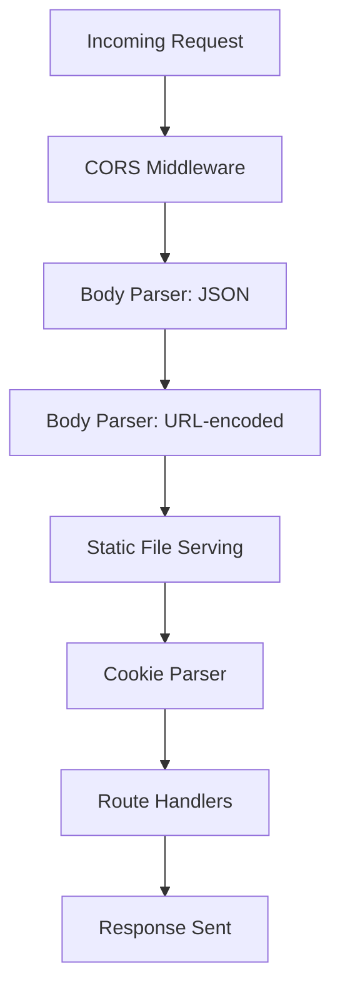
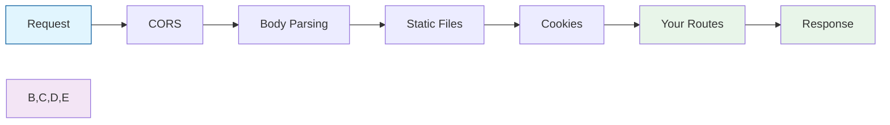

#  Day 7: Advanced Backend Architecture

## 📖 What You'll Learn Today

### 🌐 Core Features:
- ✅ **Modular Application Structure** - Clean separation of concerns
- ✅ **Professional Error Handling** - Custom API error classes and response handlers
- ✅ **Middleware Architecture** - Organized request processing pipeline
- ✅ **Static File Serving** - Efficient file handling for uploads
- ✅ **Environment Configuration** - Secure and scalable configuration management

## 🏗️ Project Structure

```
day_007/
├── config/
│   └── db.config.js     # Database configuration
├── src/
│   └── app.js          # Express application setup
├── utils/
│   ├── apiError.js     # Custom error handling
│   ├── apiRes.js       # Standardized API responses
│   ├── asyncHandler.js # Async/await error wrapper
│   └── staticFiles.js  # Static file serving utility
├── .env.sample         # Environment variables template
└── server.js           # Application entry point
```

## 🛠️ Key Components

### 1. Custom Error Handling (`utils/apiError.js`)
- Extends JavaScript's native `Error` class
- Standardized error responses
- Stack trace capturing in development
- Custom error status codes and messages

### 2. Standardized API Responses (`utils/apiRes.js`)
- Consistent response format
- Success/failure indicators
- Custom status codes and messages
- Structured data payloads

### 3. Async/Await Wrapper (`utils/asyncHandler.js`)
- Simplifies error handling in async routes
- Automatic error propagation
- Cleaner route handlers
- Prevents unhandled promise rejections

### 4. Static File Serving (`utils/staticFiles.js`)
- Configurable static file directories
- Secure file access
- Organized media handling
- Cross-platform path resolution

### 5. Express Application Setup (`src/app.js`)



#### Middleware Details:

1. **CORS (Cross-Origin Resource Sharing)**
   ```javascript
   app.use(cors({
       origin: process.env.CORS_ORIGIN,
       credentials: true
   }))
   ```
   - **Purpose**: Enables cross-origin requests from specified domains
   - **Why?**: Essential for APIs accessed by frontend applications on different domains
   - **Configuration**: 
     - `origin`: Controls which domains can access the API (use `*` for development only)
     - `credentials`: Allows sending cookies across origins

2. **Body Parser: JSON**
   ```javascript
   app.use(express.json({ limit: "1mb" }))
   ```
   - **Purpose**: Parses incoming JSON payloads
   - **Why?**: Converts JSON request bodies into JavaScript objects
   - **Limit**: 1MB max payload size to prevent large uploads
   - **Content-Type**: `application/json`

3. **Body Parser: URL-encoded**
   ```javascript
   app.use(express.urlencoded({ extended: true, limit: "1mb" }))
   ```
   - **Purpose**: Parses URL-encoded form data
   - **Why?**: Handles form submissions and query parameters
   - **Extended**: `true` allows rich objects and arrays in URL-encoded data
   - **Content-Type**: `application/x-www-form-urlencoded`

4. **Static File Serving**
   ```javascript
   serveStaticFiles(app);
   ```
   - **Purpose**: Serves static files (images, PDFs, etc.)
   - **Why?**: Efficiently serves client-side assets
   - **Paths**:
     - `/uploads/images`
     - `/uploads/files`
     - `/uploads/media`

5. **Cookie Parser**
   ```javascript
   app.use(cookieParser());
   ```
   - **Purpose**: Parses cookies attached to client requests
   - **Why?**: Essential for session management and authentication
   - **Features**:
     - Parses `Cookie` header
     - Populates `req.cookies`
     - Handles signed cookies (if configured)

#### Middleware Execution Order:



#### Why This Order Matters:
1. **CORS First**: Handle cross-origin requests before any other processing
2. **Body Parsing Early**: Parse request bodies before route handlers need them
3. **Static Files Before Routes**: More efficient than hitting route handlers for static assets
4. **Cookies Before Routes**: Parse cookies before authentication/authorization middleware
5. **Your Routes Last**: Custom route handlers execute after all standard processing


## 🌐 HTTP Status Codes Reference

<details>
<summary><strong>📖 Standard HTTP Status Codes</strong></summary>

### 1xx: Informational
- `100 Continue` - The server has received the request headers
- `101 Switching Protocols` - The requester has asked to switch protocols
- `102 Processing` - The server is processing the request

### 2xx: Success
- `200 OK` - Standard response for successful requests
- `201 Created` - Request fulfilled, new resource created
- `202 Accepted` - Request accepted but processing not complete
- `204 No Content` - Request successful but no content to return

### 3xx: Redirection
- `301 Moved Permanently` - Resource permanently moved to new URL
- `302 Found` - Resource temporarily moved to different URL
- `304 Not Modified` - Resource not modified since last request
- `307 Temporary Redirect` - Resource temporarily moved to different URL (method preserved)

### 4xx: Client Errors
- `400 Bad Request` - Server cannot process the request
- `401 Unauthorized` - Authentication required
- `403 Forbidden` - Server refuses to authorize the request
- `404 Not Found` - Resource not found
- `405 Method Not Allowed` - HTTP method not supported
- `406 Not Acceptable` - Requested format not available
- `408 Request Timeout` - Server timed out waiting for request
- `409 Conflict` - Request conflicts with current state
- `422 Unprocessable Entity` - Server understands but cannot process the request
- `429 Too Many Requests` - Too many requests in given time

### 5xx: Server Errors
- `500 Internal Server Error` - Generic server error
- `501 Not Implemented` - Server lacks ability to fulfill request
- `502 Bad Gateway` - Invalid response from upstream server
- `503 Service Unavailable` - Server temporarily unavailable
- `504 Gateway Timeout` - Upstream server failed to respond
- `505 HTTP Version Not Supported` - Server doesn't support HTTP version

### Common Status Codes in REST APIs
| Code | Status | Description |
|------|--------|-------------|
| 200 | OK | Success |
| 201 | Created | Resource created |
| 204 | No Content | Success but no content |
| 400 | Bad Request | Invalid request format |
| 401 | Unauthorized | Authentication required |
| 403 | Forbidden | Insufficient permissions |
| 404 | Not Found | Resource not found |
| 405 | Method Not Allowed | HTTP method not allowed |
| 409 | Conflict | Resource conflict |
| 422 | Unprocessable Entity | Validation error |
| 429 | Too Many Requests | Rate limit exceeded |
| 500 | Internal Server Error | Server error |
| 502 | Bad Gateway | Invalid response from upstream |
| 503 | Service Unavailable | Server temporarily down |

### Best Practices
- Use appropriate status codes for responses
- Be consistent with status code usage
- Include meaningful error messages in the response body
- Document your API's status codes
- Use 2xx for successful operations
- Use 4xx for client-side errors
- Use 5xx for server-side errors

### References
- [MDN HTTP Status Codes](https://developer.mozilla.org/en-US/docs/Web/HTTP/Status)
- [HTTP Status Codes (IETF)](https://www.iana.org/assignments/http-status-codes/http-status-codes.xhtml)
- [REST API Tutorial - Status Codes](https://restfulapi.net/http-status-codes/)
</details>


## ⚙️ Environment Configuration (`.env.sample`)

```env
# Server Configuration
PORT=3000

# MongoDB Configuration
MONGODB_URI=mongodb+srv://<user_name>:<db_password>@cluster0.kzx54ab.mongodb.net/
DB_NAME=your_database_name

# CORS Configuration
CORS_ORIGIN=*
```

## 🚀 Getting Started

1. **Clone the repository**
   ```bash
   git clone <repository-url>
   cd day_007
   ```

2. **Install dependencies**
   ```bash
   npm install
   ```

3. **Configure environment**
   ```bash
   cp .env.sample .env
   # Update .env with your configuration
   ```

4. **Start the development server**
   ```bash
   npm run dev
   ```

## 🧪 Testing

```bash
# Run tests (if available)
npm test
```

## 🎯 Key Takeaways

- **Separation of Concerns**: Clean architecture with distinct layers
- **Error Handling**: Robust error management system
- **Configuration**: Environment-based configuration
- **Code Quality**: Consistent code style and patterns
- **Scalability**: Ready for future expansion

## 📚 Resources

- [Express.js Documentation](https://expressjs.com/)
- [MongoDB Node.js Driver](https://docs.mongodb.com/drivers/node/current/)
- [Mongoose Documentation](https://mongoosejs.com/docs/)
- [Node.js Best Practices](https://github.com/goldbergyoni/nodebestpractices)

## 🔄 CORS Configuration

For CORS configuration details, please refer to [Day 3's Documentation](../day_003/README.md).

## 📝 License

This project is licensed under the MIT License - see the [LICENSE](LICENSE) file for details.

---

<div align="center">
  Made with ❤️ by kush kumar
</div>