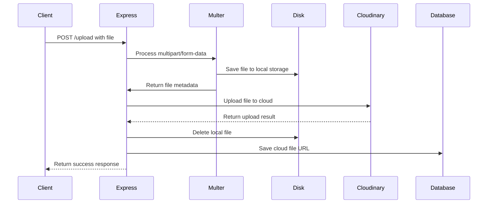
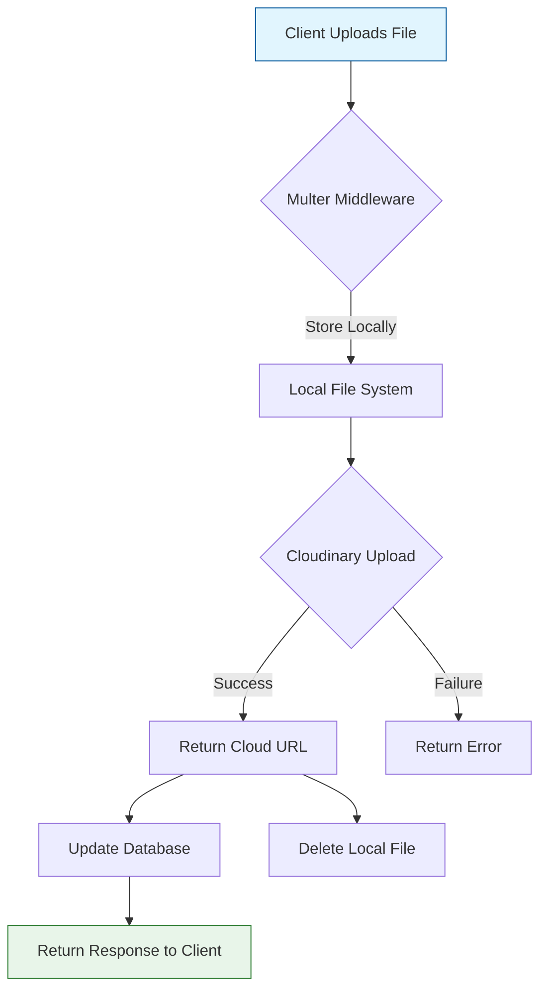

# Day 9: Cloud Storage Integration & File Upload System

> 📚 **Important**: For detailed documentation on Node.js core modules essential for backend development, see our [Node.js Modules Documentation](./docs/node-modules/README.md).

## 📖 What You'll Learn Today

This module builds on our authentication system and data models to implement a complete file upload system with both local storage and cloud integration for our video platform.

- ✅ **File Upload System** - Securely handle user-uploaded files, images, and media
- ✅ **Cloudinary Integration** - Store and manage files in the cloud
- ✅ **Multer Middleware** - Handle multipart/form-data for file uploads
- ✅ **Error Handling** - Advanced error management for file operations
- ✅ **Content Organization** - Structure for managing different file types

## 🏗️ Project Structure

```
day_009/
├── config/
│   └── db.config.js         # Database configuration
├── controllers/
│   └── .gitkeep             # Controllers for user and video operations
├── middlewares/
│   └── multer.middleware.js # File upload middleware with multer
├── models/
│   ├── user.model.js        # User schema with auth methods
│   └── video.model.js       # Video content schema
├── routes/
│   └── .gitkeep             # API route definitions
├── src/
│   └── app.js               # Express application setup
├── tests/
│   └── .gitkeep             # Test files
├── uploads/                 # Organized file storage
│   ├── files/               # Document storage
│   ├── images/              # Image storage
│   └── media/               # Video media storage
├── utils/
│   ├── apiError.js          # Custom error handling
│   ├── apiRes.js            # Standardized API responses
│   ├── asyncHandler.js      # Async/await error wrapper
│   ├── cloudinary.js        # Cloudinary integration
│   └── staticFiles.js       # Static file serving utility
├── .env                     # Environment variables (git-ignored)
├── .env.sample              # Environment variables template
├── package.json             # Project dependencies
└── server.js                # Application entry point
```

## 🛠️ Key Components

### 1. Multer Middleware (`middlewares/multer.middleware.js`)

- **File Upload Handler**: Processes multipart/form-data requests
- **Storage Configuration**: Defines where and how files are stored
- **File Type Routing**: Directs files to appropriate folders based on type
- **Filename Generation**: Creates unique filenames to prevent conflicts
- **Size Limits**: Prevents large file uploads that could cause issues

```javascript
// Configuration excerpt
const storage = multer.diskStorage({
    destination: function (req, file, cb) {
        // Choose destination based on file type
        let uploadDir = "uploads/files";

        if (file.mimetype.startsWith("image/")) {
            uploadDir = "uploads/images";
        } else if (file.mimetype.startsWith("video/")) {
            uploadDir = "uploads/media";
        }

        cb(null, uploadDir);
    },
    filename: function (req, file, cb) {
        // Create unique filename: timestamp + original name
        const uniqueSuffix = Date.now() + "-" + Math.round(Math.random() * 1e9);
        const extension = path.extname(file.originalname);
        cb(null, uniqueSuffix + extension);
    },
});
```

### 2. Cloudinary Integration (`utils/cloudinary.js`)

- **Cloud Storage**: Upload files to Cloudinary for permanent storage
- **Resource Type Detection**: Automatically detects file types
- **File Management**: Upload and delete operations for different file types
- **Local Cleanup**: Removes local files after successful cloud upload
- **Error Handling**: Manages upload failures gracefully

```javascript
// Example usage
const uploadToCloudinary = async (filePath) => {
    try {
        if (!filePath) throw new Error("No file path provided");
        const result = await cloudinary.uploader.upload(filePath, {
            resource_type: resourceTypeUtility(filePath),
        });
        return result;
    } catch (error) {
        console.error("Cloudinary upload failed:", error);
    } finally {
        if (fs.existsSync(filePath)) {
            fs.unlinkSync(filePath);
        }
    }
};
```

### 3. Static File Serving (`utils/staticFiles.js`)

- **Express Middleware**: Configures routes for static file access
- **Path Resolution**: Handles relative and absolute paths correctly
- **Directory Structure**: Organizes files by type and purpose
- **Direct File Access**: Enables direct URLs to uploaded files
- **Cross-Origin Access**: Supports frontend access to media files

```javascript
// Static file serving configuration
export default function serveStaticFiles(app) {
    app.use("/uploads/images", express.static(path.join(rootDir, "uploads/images")));
    app.use("/uploads/files", express.static(path.join(rootDir, "uploads/files")));
    app.use("/uploads/media", express.static(path.join(rootDir, "uploads/media")));
}
```

### 4. File Upload Flow



## ⚙️ Environment Configuration (`.env.sample`)

```env
PORT=3000

# MongoDB Configuration
MONGODB_URI=mongodb+srv://<user_name>:<db_password>@cluster0.kzx54ab.mongodb.net/
DB_NAME=DATABASE_NAME

# CORS Configuration
CORS_ORIGIN=*

# JWT (Access Token)
JWT_SECRET=your_jwt_secret
JWT_EXPIRES_IN=1d

# Password Hashing
BCRYPT_SALT_ROUNDS=10

# Refresh Token
REFRESH_TOKEN_SECRET=your_refresh_token_secret
REFRESH_TOKEN_EXPIRES_IN=7d

# Cloudinary Configuration
CLOUDINARY_CLOUD_NAME=your_cloud_name
CLOUDINARY_API_KEY=your_api_key
CLOUDINARY_API_SECRET=your_api_secret
```

## 🔧 File Upload System

### Multer Configuration

Multer is a Node.js middleware for handling `multipart/form-data`, primarily used for file uploads. Our configuration:

```javascript
// Simple file size limits
const limits = {
    fileSize: 50 * 1024 * 1024, // 50MB
};

// Create the multer upload instances
const upload = multer({
    storage,
    limits,
});

// Export specific upload functions
export const uploadSingle = upload.single("file");
export const uploadImage = upload.single("image");
export const uploadVideo = upload.fields([
    { name: "videoFile", maxCount: 1 },
    { name: "thumbnail", maxCount: 1 },
]);
```

### Supported File Types

| Category  | Extensions                     | Storage Location   | Cloud Resource Type |
| --------- | ------------------------------ | ------------------ | ------------------- |
| Images    | .jpg, .jpeg, .png, .gif, .webp | `/uploads/images/` | image               |
| Videos    | .mp4, .mov, .webm, .avi, .mkv  | `/uploads/media/`  | video               |
| Documents | .pdf, etc.                     | `/uploads/files/`  | raw                 |

### Cloudinary Integration

Cloudinary is a cloud service that provides image and video management solutions. Our integration handles:

1. **File Upload**: Transfers files from local storage to cloud
2. **File Type Detection**: Determines the correct resource type
3. **File Deletion**: Removes files from cloud when needed
4. **Local Cleanup**: Removes temporary local files after upload

### File Upload Flow Diagram



### File Structure in Cloudinary

Files in Cloudinary are organized by:

1. **Resource Type**: image, video, raw
2. **Delivery Type**: upload, private, authenticated
3. **Transformation**: Any applied transformations
4. **Version**: File version number
5. **Public ID**: Unique identifier for the file

Example URL: `https://res.cloudinary.com/demo/image/upload/v1234567890/sample_id.jpg`

### Sample Cloudinary Response

```json
{
    "public_id": "sample_id",
    "version": 1234567890,
    "signature": "sample_signature",
    "width": 800,
    "height": 600,
    "format": "jpg",
    "resource_type": "image",
    "created_at": "2023-01-01T00:00:00Z",
    "url": "https://res.cloudinary.com/demo/image/upload/v1234567890/sample_id.jpg",
    "secure_url": "https://res.cloudinary.com/demo/image/upload/v1234567890/sample_id.jpg",
    "original_filename": "sample"
}
```

## 🚀 Getting Started

1. **Clone the repository**

    ```bash
    git clone <repository-url>
    cd day_009
    ```

2. **Install dependencies**

    ```bash
    npm install
    ```

3. **Configure environment**

    ```bash
    cp .env.sample .env
    # Update .env with your configuration
    ```

4. **Create upload directories**

    ```bash
    mkdir -p uploads/images uploads/files uploads/media
    ```

5. **Set up Cloudinary account**
    - Create an account at [cloudinary.com](https://cloudinary.com)
    - Get your cloud name, API key, and API secret
    - Add them to your `.env` file

6. **Start the development server**
    ```bash
    npm run dev
    ```

## 📝 Implementation Notes

### Adding Cloudinary to Your Project

1. **Install Dependencies**

    ```bash
    npm install cloudinary
    ```

2. **Configure Cloudinary**

    ```javascript
    import { v2 as cloudinary } from "cloudinary";

    cloudinary.config({
        cloud_name: process.env.CLOUDINARY_CLOUD_NAME,
        api_key: process.env.CLOUDINARY_API_KEY,
        api_secret: process.env.CLOUDINARY_API_SECRET,
    });
    ```

3. **Create Upload Utility**

    ```javascript
    const uploadToCloudinary = async (filePath) => {
        try {
            if (!filePath) throw new Error("No file path provided");
            const result = await cloudinary.uploader.upload(filePath, {
                resource_type: resourceTypeUtility(filePath),
            });
            return result;
        } catch (error) {
            console.error("Cloudinary upload failed:", error);
        } finally {
            if (fs.existsSync(filePath)) {
                fs.unlinkSync(filePath);
            }
        }
    };
    ```

### Using Multer in Your Routes

```javascript
import { uploadImage, uploadVideo } from "../middlewares/multer.middleware.js";
import { uploadToCloudinary } from "../utils/cloudinary.js";

// Route for uploading a profile picture
router.post("/upload-avatar", uploadImage, async (req, res) => {
    try {
        const localFilePath = req.file.path;
        const cloudinaryResult = await uploadToCloudinary(localFilePath);

        // Update user profile with cloudinary URL
        await User.findByIdAndUpdate(req.user._id, {
            avatar: cloudinaryResult.secure_url,
            avatarId: cloudinaryResult.public_id,
        });

        return res.status(200).json({
            success: true,
            message: "Avatar uploaded successfully",
            avatar: cloudinaryResult.secure_url,
        });
    } catch (error) {
        return res.status(500).json({
            success: false,
            message: "Error uploading avatar",
        });
    }
});
```

## 🎯 Key Takeaways

- **Hybrid Storage**: Local temporary storage with cloud permanent storage
- **Middleware Design**: Multer configuration for file type handling
- **Cloudinary Integration**: Cloud storage for scalable media hosting
- **Security**: Proper file validation and handling practices
- **Resource Cleanup**: Automatic removal of temporary files

## 📚 Resources

- [Multer Documentation](https://github.com/expressjs/multer)
- [Cloudinary Node.js SDK](https://cloudinary.com/documentation/node_integration)
- [Express Static Files](https://expressjs.com/en/starter/static-files.html)
- [File Upload Security](https://cheatsheetseries.owasp.org/cheatsheets/File_Upload_Cheat_Sheet.html)
- [Content Delivery Optimization](https://web.dev/fast/#optimize-your-content-for-your-users)

## 🔄 Previous Day's Work

For user authentication and data models, refer to [Day 8's Documentation](../day_008/README.md).

## 📝 License

This project is licensed under the MIT License - see the [LICENSE](LICENSE) file for details.

---

<div align="center">
  Made with ❤️ by kush kumar
</div>
