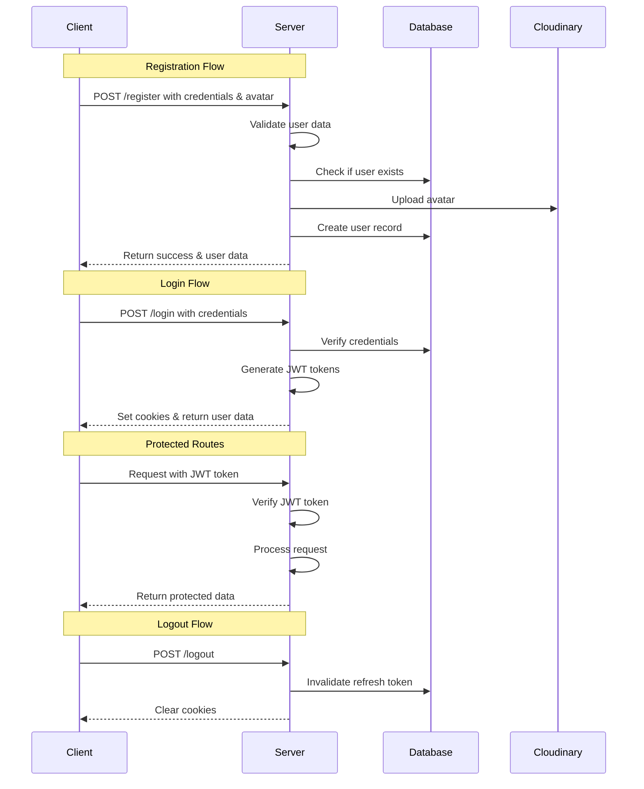

# Day 10: Advanced Authentication & Improved Error Handling

Building on our previous work, Day 10 focuses on enhancing user authentication, implementing robust error handling, and improving the overall architecture of our backend system.

## 📖 What You'll Learn Today

- ✅ **Complete Authentication Flow** - Login, logout, and token refresh
- ✅ **Advanced Error Handling** - Centralized error management with file cleanup
- ✅ **Data Validation** - Flexible validation for create and update operations
- ✅ **Standardized API Responses** - Consistent response formats using apiRes and apiError
- ✅ **Security Best Practices** - JWT handling, password security, and more

## 🏗️ Project Structure

```
day_010/
├── config/
│   └── db.config.js         # Database configuration
├── controllers/
│   └── user.controller.js   # User authentication and management
├── middlewares/
│   ├── auth.middleware.js   # JWT verification middleware
│   └── multer.middleware.js # Enhanced file upload middleware
├── models/
│   ├── user.model.js        # User schema with auth methods
│   └── video.model.js       # Video content schema
├── routes/
│   └── user.routes.js       # User authentication routes
├── src/
│   └── app.js               # Express app with improved error handling
├── tests/
│   └── .gitkeep             # Test files
├── uploads/
│   ├── files/               # Document storage
│   ├── images/              # Image storage
│   ├── media/               # Video media storage
│   └── temp/                # Temporary file storage for uploads
├── utils/
│   ├── apiError.js          # Enhanced error handling
│   ├── apiRes.js            # Standardized API responses
│   ├── asyncHandler.js      # Async/await error wrapper
│   ├── cloudinary.js        # Improved Cloudinary integration
│   ├── staticFiles.js       # Static file serving utility
│   └── validation.js        # User data validation utility
├── .env                     # Environment variables (git-ignored)
├── .env.sample              # Environment variables template
├── package.json             # Project dependencies
└── server.js                # Application entry point
```

## 🔑 Key Improvements

### 1. Complete Authentication Flow

We've implemented the full authentication cycle with:

- **User Registration** - Create new accounts with profile images
- **User Login** - Authenticate with username/email and password
- **User Logout** - Secure token invalidation
- **Token Refresh** - Generate new access tokens using refresh tokens



### 2. Advanced Error Handling

Our new error handling system provides:

- **Centralized Error Management** - Global middleware catches all errors
- **Automatic File Cleanup** - Removes temporary files when errors occur
- **Structured Error Responses** - Consistent error format with detailed information
- **Standardized Status Codes** - Proper HTTP status codes for different error types
- **Development Mode Support** - Additional stack traces in development environment

```javascript
// Global error handler with file cleanup
app.use((err, req, res, next) => {
    console.error("Error encountered:", err);

    // Check if request had files uploaded and clean them up
    if (req.files) {
        const filesToDelete = [];
        Object.values(req.files).forEach((fileArray) => {
            fileArray.forEach((file) => {
                if (file && file.path) {
                    filesToDelete.push(file.path);
                }
            });
        });

        // Delete all collected files
        if (filesToDelete.length > 0) {
            filesToDelete.forEach((filePath) => {
                try {
                    if (fs.existsSync(filePath)) {
                        fs.unlinkSync(filePath);
                        console.log(`Cleaned up temporary file: ${filePath}`);
                    }
                } catch (unlinkErr) {
                    console.error(`Failed to delete temp file: ${filePath}`, unlinkErr);
                }
            });
        }
    }

    // Standardized error response format
    // [Response code omitted for brevity]
});
```

### 3. Improved File Upload System

We've enhanced our file upload system to be more robust and flexible:

- **Dynamic Multer Configuration** - Create uploader instances with specific file types and size limits
- **Temporary File Directory** - Store uploads in a temp directory before cloud processing
- **Automatic Cleanup** - Remove local files after successful upload or on error
- **Error Handling Integration** - Works with our global error handler

```javascript
export const createUploader = (allowedTypes, maxSizeMB) => {
    return multer({
        storage,
        fileFilter: createFileFilter(allowedTypes),
        limits: { fileSize: maxSizeMB * 1024 * 1024 }, // in bytes
    });
};

// Usage example
router.post(
    "/register",
    createUploader(["image/jpeg", "image/png", "image/gif"], 5).fields([
        { name: "avatar", maxCount: 1 },
        { name: "coverImage", maxCount: 1 },
    ]),
    registerUser
);
```

### 4. Smart Validation System

Our validation system now:

- **Validates Only Provided Fields** - Perfect for partial updates
- **Provides Detailed Error Messages** - Clear instructions for fixing invalid data
- **Separates Validation Logic** - Keeps controllers clean and focused
- **Username Format Requirements** - Usernames must start with @ followed by alphanumeric characters
- **Password Security Requirements** - Enforces strong password rules

```javascript
// Username validation (if provided)
if (userName !== undefined) {
    if (typeof userName !== "string" || !/^@[A-Za-z0-9]{2,19}$/.test(userName.trim())) {
        throw new apiError(400, "Invalid user name. Must start with @ followed by 2-19 alphanumeric characters", [
            "userName",
        ]);
    }
}

// Password validation (if provided)
if (password !== undefined) {
    if (
        typeof password !== "string" ||
        !/^(?=.*[a-z])(?=.*[A-Z])(?=.*\d)(?=.*[@$!%*?&])[A-Za-z\d@$!%*?&]{8,30}$/.test(password.trim())
    ) {
        throw new apiError(
            400,
            "Password must contain at least one uppercase letter, one lowercase letter, one number, and one special character (@$!%*?&)",
            ["password"]
        );
    }
}
```

### 5. Enhanced Cloudinary Integration

Our Cloudinary utility now:

- **Supports Folder Organization** - Upload files to specific folders
- **Automatic Resource Type Detection** - Determines file type based on extension
- **Better Error Handling** - More detailed error information
- **Local File Management** - Option to keep or delete local files after upload
- **Integration with apiError** - Uses our standardized error system

```javascript
const uploadToCloudinary = async (filePath, folder = "", autoDelete = true) => {
    try {
        if (!filePath) throw new apiError(400, "No file path provided", ["filePath"]);

        // Verify the file exists
        if (!fs.existsSync(filePath)) {
            throw new apiError(404, `File not found at path: ${filePath}`, ["filePath"]);
        }

        // Prepare upload options with folder support
        const uploadOptions = {
            resource_type: resourceTypeUtility(filePath),
            timestamp: Math.floor(Date.now() / 1000),
            use_filename: true,
            unique_filename: true,
        };

        if (folder) {
            uploadOptions.folder = folder;
        }

        const result = await cloudinary.uploader.upload(filePath, uploadOptions);
        return result;
    } catch (error) {
        // Error handling with apiError integration
        // [Code omitted for brevity]
    } finally {
        // Local file cleanup
        // [Code omitted for brevity]
    }
};
```

## 🚀 Authentication Flow

### Registration Process

1. User submits registration form with credentials and avatar
2. Server validates all required fields and data formats
3. Server checks if username or email already exists
4. Avatar is uploaded to Cloudinary (and coverImage if provided)
5. User record is created in the database with encrypted password
6. Success response is returned with user data (minus sensitive fields)

### Login Process

1. User submits login form with username/email and password
2. Server validates credentials against database
3. Server generates JWT access token and refresh token
4. Refresh token is stored in the database
5. Both tokens are set as HTTP-only cookies
6. Success response is returned with user data

### Protected Route Access

1. Client makes request with access token in cookies or Authorization header
2. Auth middleware verifies the token and extracts user ID
3. User data is attached to the request object
4. Route handler processes the authenticated request
5. Response is returned to the client

### Token Refresh Process

1. When access token expires, client sends refresh token to /token endpoint
2. Server verifies refresh token against database
3. Server generates new access token and refresh token
4. New refresh token is stored in the database
5. Both tokens are set as HTTP-only cookies
6. Success response is returned with user data

## 📊 Response Format Standardization

### Success Response Format (apiRes)

```javascript
{
  "statusCode": 200,
  "data": { /* Response data */ },
  "message": "Operation successful",
  "success": true
}
```

### Error Response Format (apiError)

```javascript
{
  "statusCode": 400,
  "data": null,
  "message": "Validation error",
  "success": false,
  "errors": ["field1", "field2"],
  "stack": "Error stack trace (development mode only)"
}
```

## 🔧 Getting Started

1. **Clone the repository**

    ```bash
    git clone <repository-url>
    cd day_010
    ```

2. **Install dependencies**

    ```bash
    npm install
    ```

3. **Configure environment**

    ```bash
    cp .env.sample .env
    # Update .env with your configuration
    ```

4. **Create upload directories**

    ```bash
    mkdir -p uploads/images uploads/files uploads/media uploads/temp
    ```

5. **Set up Cloudinary account**
    - Create an account at [cloudinary.com](https://cloudinary.com)
    - Get your cloud name, API key, and API secret
    - Add them to your `.env` file

6. **Start the development server**
    ```bash
    npm run dev
    ```

## 📝 Implementation Notes

### Using Authentication in Your Routes

```javascript
import verifyJWT from "../middlewares/auth.middleware.js";

// Public routes
router.post("/register", ...);
router.post("/login", ...);
router.post("/token", ...);

// Protected routes
router.post("/logout", verifyJWT, ...);
router.get("/profile", verifyJWT, ...);
router.patch("/profile", verifyJWT, ...);
```

### Validating User Data

```javascript
import { ValidateUser } from "../utils/validation.js";

// In your controller
const createUser = async (req, res) => {
    // Check required fields first
    if (!req.body.email || !req.body.password) {
        throw new apiError(400, "Missing required fields");
    }

    // Then validate format of provided fields
    ValidateUser(req.body);

    // Proceed with user creation
};
```

### Handling File Uploads

```javascript
// In your routes file
router.post(
    "/upload-profile",
    verifyJWT,
    createUploader(["image/jpeg", "image/png"], 2).single("profileImage"),
    uploadProfileImage
);

// In your controller
const uploadProfileImage = async (req, res) => {
    if (!req.file) {
        throw new apiError(400, "No image provided");
    }

    const result = await uploadToCloudinary(req.file.path, "user-profiles", true);

    // Update user profile with new image URL
    // ...
};
```

## 🎯 Key Takeaways

- **Complete Auth System**: Full authentication flow with JWT tokens
- **Error Handling**: Centralized error management with file cleanup
- **Validation**: Flexible validation system for user data
- **File Management**: Improved file upload and cloud storage
- **API Consistency**: Standardized response formats
- **Security**: Best practices for user authentication and data protection

## 📚 Resources

- [JWT Authentication](https://jwt.io/introduction)
- [Express Error Handling](https://expressjs.com/en/guide/error-handling.html)
- [Multer Documentation](https://github.com/expressjs/multer)
- [Cloudinary Node.js SDK](https://cloudinary.com/documentation/node_integration)
- [Password Security Best Practices](https://cheatsheetseries.owasp.org/cheatsheets/Password_Storage_Cheat_Sheet.html)

## 🔄 Previous Day's Work

For file upload system and cloud storage, refer to [Day 9's Documentation](../day_009/README.md).

## 📝 License

This project is licensed under the MIT License - see the [LICENSE](LICENSE) file for details.

---

<div align="center">
  Made with ❤️ by kush kumar
</div>
