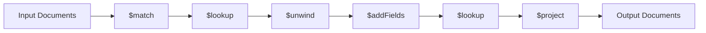

# Day 11: Advanced MongoDB Aggregation & Project Completion

Welcome to the final day of our MERN backend series! Today we've focused on advanced MongoDB aggregation pipelines and bringing together all the concepts we've learned throughout this journey.

## 📖 What You'll Learn Today

- ✅ **Advanced MongoDB Aggregation** - Complex data transformations and lookups
- ✅ **User Channel Features** - Channel details and subscribed channels
- ✅ **Relational Data in NoSQL** - Modeling relationships across collections
- ✅ **Optimized API Design** - Efficient data retrieval patterns
- ✅ **Project Completion** - Full-featured video streaming platform backend

## 🏗️ Project Structure

```
day_011/
├── config/
│   └── db.config.js         # Database configuration
├── controllers/
│   └── user.controller.js   # User and channel operations
├── middlewares/
│   ├── auth.middleware.js   # JWT verification middleware
│   └── multer.middleware.js # File upload middleware
├── models/
│   ├── user.model.js        # User schema with auth methods
│   └── video.model.js       # Video content schema
├── routes/
│   └── user.routes.js       # User API routes
├── src/
│   └── app.js               # Express app configuration
├── utils/
│   ├── apiError.js          # Error handling utility
│   ├── apiRes.js            # Response standardization
│   ├── asyncHandler.js      # Async error wrapper
│   ├── cloudinary.js        # Cloud storage integration
│   ├── staticFiles.js       # Static file serving utility
│   └── validation.js        # Data validation utility
├── package.json             # Project dependencies
└── server.js                # Application entry point
```

## � MongoDB Aggregation Mastery

In this final day, we've implemented powerful MongoDB aggregation pipelines to efficiently retrieve complex data:

### 1. User Channel Details

The `getUserChannel` controller uses MongoDB's aggregation framework to build a comprehensive channel profile:

```javascript
const getUserChannel = asyncHandler(async (req, res) => {
    const { userName } = req.params;
    
    // Use aggregation to gather channel data
    const channel = await User.aggregate([
        // Match the user by username
        {
            $match: {
                userName: userName.toLowerCase()
            }
        },
        // Lookup to count subscribers
        {
            $lookup: {
                from: "subscriptions",
                localField: "_id",
                foreignField: "channel",
                as: "subscribers"
            }
        },
        // Lookup to count subscriptions
        {
            $lookup: {
                from: "subscriptions",
                localField: "_id",
                foreignField: "subscriber",
                as: "subscribedTo"
            }
        },
        // Add computed fields
        {
            $addFields: {
                subscribersCount: { $size: "$subscribers" },
                subscribedToCount: { $size: "$subscribedTo" },
                isSubscribed: {
                    $cond: {
                        if: { $in: [req.user?._id, "$subscribers.subscriber"] },
                        then: true,
                        else: false
                    }
                }
            }
        },
        // Lookup to get videos published by this user
        {
            $lookup: {
                from: "videos",
                localField: "_id",
                foreignField: "owner",
                as: "videos",
                pipeline: [
                    // Only include published videos
                    { $match: { isPublished: true } },
                    // Project only needed fields
                    {
                        $project: {
                            _id: 1,
                            title: 1,
                            thumbnail: 1,
                            duration: 1,
                            views: 1,
                            createdAt: 1
                        }
                    }
                ]
            }
        },
        // Add field for video count
        {
            $addFields: {
                videoCount: { $size: "$videos" },
                // Calculate total views across all videos
                totalViews: { $sum: "$videos.views" }
            }
        },
        // Project final fields to return
        {
            $project: {
                _id: 1,
                userName: 1,
                fullName: 1,
                email: 1,
                avatar: 1,
                coverImage: 1,
                subscribersCount: 1,
                subscribedToCount: 1,
                isSubscribed: 1,
                videoCount: 1,
                totalViews: 1,
                createdAt: 1,
                videos: {
                    $slice: ["$videos", 0, 6] // Return only first 6 videos
                }
            }
        }
    ]);

    if (!channel || channel.length === 0) {
        throw new apiError(404, "Channel not found");
    }

    return res.status(200).json(
        new apiRes(200, { channel: channel[0] }, "User channel fetched successfully")
    );
});
```

### 2. Subscribed Channels List

The `getSubscribedChannels` controller provides a complete view of all channels a user is subscribed to:

```javascript
const getSubscribedChannels = asyncHandler(async (req, res) => {
    const userId = req.user._id;
    
    // Find all channels the user is subscribed to
    const subscribedChannels = await User.aggregate([
        // Get all subscriptions of the user
        {
            $lookup: {
                from: "subscriptions",
                let: { userId: userId },
                pipeline: [
                    {
                        $match: {
                            $expr: { $eq: ["$subscriber", "$$userId"] }
                        }
                    }
                ],
                as: "userSubscriptions"
            }
        },
        // Process each subscription
        {
            $unwind: "$userSubscriptions"
        },
        // Get channel details
        {
            $lookup: {
                from: "users",
                localField: "userSubscriptions.channel",
                foreignField: "_id",
                as: "channelInfo"
            }
        },
        // Get latest videos
        {
            $lookup: {
                from: "videos",
                let: { channelId: "$channelInfo._id" },
                pipeline: [
                    {
                        $match: {
                            $expr: {
                                $eq: ["$owner", "$$channelId"]
                            },
                            isPublished: true
                        }
                    },
                    {
                        $sort: { createdAt: -1 }
                    },
                    {
                        $limit: 3 // Get only the 3 latest videos
                    }
                ],
                as: "latestVideos"
            }
        },
        // Add computed fields
        {
            $addFields: {
                videoCount: { $size: "$latestVideos" },
                subscribedSince: "$userSubscriptions.createdAt",
                subscriberCount: {
                    $cond: {
                        if: { $gt: [{ $size: "$subscriberCount" }, 0] },
                        then: { $arrayElemAt: ["$subscriberCount.total", 0] },
                        else: 0
                    }
                }
            }
        },
        // Final projection
        {
            $project: {
                _id: "$channelInfo._id",
                userName: "$channelInfo.userName",
                fullName: "$channelInfo.fullName",
                avatar: "$channelInfo.avatar",
                coverImage: "$channelInfo.coverImage",
                subscribedSince: 1,
                subscriberCount: 1,
                videoCount: 1,
                latestVideos: 1
            }
        }
    ]);
    
    return res.status(200).json(
        new apiRes(200, { subscribedChannels }, "Subscribed channels fetched successfully")
    );
});
```

## 🎯 Key Learnings From This Series

Throughout this 11-day journey, we've built a comprehensive backend system with:

### 1. **Modern Node.js Architecture**
   - Express.js framework for robust API development
   - ES Modules for clean, modern JavaScript
   - Structured project organization for maintainability

### 2. **Advanced MongoDB Integration**
   - Mongoose ODM for schema validation and model management
   - Complex aggregation pipelines for efficient data operations
   - Relational data modeling in a NoSQL environment

### 3. **Authentication & Security**
   - JWT-based authentication with refresh tokens
   - Password hashing with bcrypt
   - HTTP-only cookies for secure token storage
   - Middleware for route protection

### 4. **File Management**
   - Multer for multipart form handling
   - Cloudinary for cloud-based asset storage
   - File type validation and size restrictions
   - Automatic cleanup of temporary files

### 5. **Error Handling & Response Standardization**
   - Centralized error management
   - Consistent API response format
   - Detailed validation error reporting
   - Async/await error wrapping

### 6. **Best Practices**
   - Environment-based configuration
   - Separation of concerns (MVC pattern)
   - Middleware composition
   - Input validation and sanitization

## 📊 MongoDB Aggregation Framework

The MongoDB Aggregation Framework has been crucial for our application's data needs:

### Key Aggregation Operators

- **$match**: Filter documents to pass only the documents that match specified conditions
- **$lookup**: Performs a left outer join to another collection
- **$project**: Reshapes documents by including, excluding, or computing fields
- **$addFields**: Adds new fields to documents
- **$unwind**: Deconstructs an array field to create a document for each element
- **$group**: Groups documents by a specified expression
- **$sort**: Sorts all documents in the pipeline
- **$limit**: Limits the number of documents passed to the next stage
- **$cond**: Conditional operator for creating dynamic fields

### Aggregation Pipeline Stages



## � API Routes Overview

Our backend now provides the following API endpoints:

### Authentication
- `POST /api/v1/users/register` - Register a new user with profile images
- `POST /api/v1/users/login` - Authenticate user and get tokens
- `POST /api/v1/users/logout` - Logout and invalidate tokens
- `POST /api/v1/users/token` - Refresh access token

### User Management
- `GET /api/v1/users/profile` - Get authenticated user's profile
- `PATCH /api/v1/users/profile` - Update user profile information
- `POST /api/v1/users/change-password` - Update user password

### Channel Features
- `GET /api/v1/users/channel/:userName` - Get channel details by username
- `GET /api/v1/users/subscriptions` - Get list of subscribed channels

### Videos (Implemented in previous days)
- Video upload and management
- Video streaming
- Like/dislike and comment functionality

## 📚 Techniques & Libraries Used

Throughout this series, we've leveraged the following technologies:

- **Node.js** - JavaScript runtime
- **Express** - Web framework
- **MongoDB** - NoSQL database
- **Mongoose** - MongoDB ODM
- **JWT** - Authentication tokens
- **Bcrypt** - Password hashing
- **Multer** - File upload handling
- **Cloudinary** - Cloud asset management
- **CORS** - Cross-Origin Resource Sharing
- **Dotenv** - Environment management
- **Nodemon** - Development server

## 🚀 What's Next?

While this concludes our backend series, there are many ways to extend this project:

- **Frontend Integration** - Build a React frontend for the API
- **Real-time Features** - Add WebSockets for live notifications
- **Analytics** - Implement view tracking and user analytics
- **Recommendation Engine** - Create content recommendation algorithms
- **Monetization** - Add payment processing for premium content

## 🔧 Getting Started

1. **Clone the repository**

    ```bash
    git clone <repository-url>
    cd day_011
    ```

2. **Install dependencies**

    ```bash
    npm install
    ```

3. **Configure environment**

    ```bash
    cp .env.sample .env
    # Update .env with your configuration
    ```

4. **Start the development server**
    ```bash
    npm run dev
    ```

## 📝 License

This project is licensed under the MIT License - see the [LICENSE](LICENSE) file for details.

---

<div align="center">
  <h3>Thank you for following this MERN Backend series!</h3>
  <p>We've covered everything from basic setup to advanced MongoDB aggregation pipelines. This foundational knowledge will serve you well in building robust backend systems.</p>
  <p>Made with ❤️ by kush kumar</p>
</div>
